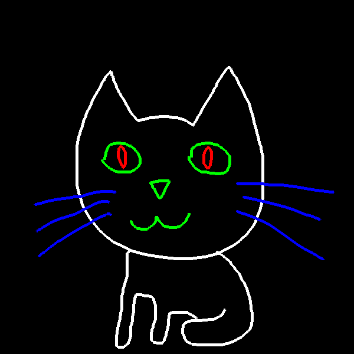

# PyGame u Pajtonu
Materijali za kurs PyGame у Pajtonu

## Plan Rada

*Dvocas 1*: Dvodimenziona grafika i biblioteka Pygame, koriscenje, instalacija

1. nedelja (3.10)
    * [Uputstvo za instalaciju PyGame-a i PyCharm-a kod kuce](cas_01/instalacija_kod_kuce.md)

*Dvocas 2-3*: Crtanje osnovnih oblika (boje, koordinate, duzi, pravougaonici, krugovi)  

2. nedelja (10.10)
    * [Koordinate, boje, duzi, pravougaonici i krugovi](cas_02/2_crtanje_osnovnih_oblika.md)
    * [Kod sa casa](cas_02/cas_2.py)
    * [Zadaci i domaci](cas_02/zadaci.jpg)
3. nedelja (17.10)
    * [Elipse i mnogouglovi](cas_03/3_crtanje_elipsi_mnogouglova.md)
    * Kodovi sa casa: 
      [elipsa](cas_03/elipsa.py),
      [ivica](cas_03/ivica.py),
      [trougao](cas_03/trougao.py),
      [mnogougao](cas_03/mnogougao.py)
    * [Jelka](cas_03/jelka.py) i [dijagram](cas_03/jelka.jpg)
    * [Zadatak sa casa](cas_03/zvezda.jpg) i [domaci](cas_03/3_domaci.md)

*Dvocas 4-6*: Crtanje pravilnih oblika uz pomoc petlji

4. nedelja (24.10)  
    * [Obnavljanje](cas_04/4_obnavljanje.md)
    * [Petlje su kul + domaci](cas_04/4_zadaci_i_domaci.md)
    * [Bonus zadatak: sahovska tabla](cas_04/4_bonus.md)
    * [Animacija kretanja](cas_04/4_animacija.md)
5. nedelja (31.10)
    * [Zadaci sa casa](cas_05/5_petlje_vezbanje.md) i [resenja](cas_05)
    * [Domaci 1: bonus zadatak sa proslog casa](cas_04/4_bonus.md)
    * [Domaci 2](cas_05/5_domaci.md) ([resenje](cas_05/domaci_resenje.py))
6. nedelja (7.11)
    * Podsetniik: 
   [osnovna struktura PyGame programa](cas_06/podsetnik_osnovna_struktura.md) & 
   [spisak funkcija za crtanje](cas_06/podsetnik_crtanje.md)
    * [Veliki Domaci](cas_06/6_domaci.md) i [resenja](cas_07/domaci_resenja)

*Dvocas 7-10:* Animacije, simulacija kretanja

7. nedelja (28.11)
    * [Resenja domaceg zadatka](cas_07/domaci_resenja)
    * [Iscrtavanje slike i transofrmacije](cas_07/sprite.py)
    * [Animacija smenjivanjem slika](cas_07/animirana_macka.py)
    * [Slicice (zip)](https://github.com/daniilgrbic/PyGame-u-Pajtonu/releases/download/assets/macka_puca.zip)
8. nedelja (5.12)
    * [Leteci mis](cas_08/slepi_mis_1.py)
    * [Novi sablon](cas_08/template.py)
    * [Strukture](cas_08/strukture.py)
    * [Leteci mis sa novim sablonomi strukturom](cas_08/slepi_mis_2.py)
9. nedelja (12.12)
    * [kretanje.py](cas_09/kretanje.py) (mis se krece u jednm pravcu)
    * [odbijanje.py](cas_09/odbijanje_od_zidova.py) (mis se odbija i ide levo desno)
    * [skrinsejver.py](cas_09/skrinsejver.py) (mis se odbija od sva cetiri zida i ne moze da napusit prozor)
    * Domaci: proci kroz fajl [koriscenje_vektora.py](cas_09/koriscenje_vektora.py)
10. nedelja (26.12)

*Dvocas 11-13*: Upravljanje dogadjajima, programiranje reakcije programa na koriscenje misa i tastature

11. nedelja (30.1)
    * [Aktivno pracenje klika](cas_11/get_pressed.py)
    * [Dogadjaji](cas_11/dogadjaji.py)
    * [Kostur programa](cas_08/template.py)
12. nedelja (6.2)
    * [paint.py](cas_12/paint.py) i [poboljsan paint.py](cas_12/paint_poboljsan.py) 
       
    * [Matrice i domaci](cas_12/matrice.md)
    * [Iks Oks sa komentarima](cas_12/iks_oks.py) 
13. nedelja (6.3)
    * [Obnavljanje](cas_13/tabla.jpg)
14. nedelja (13.3)
    * [Kretanje pomocu malih intervala vremena](cas_14/kretanje_delta.md)
    * Kodovi: [auto.py](cas_14/auto.py) i [raketa.py](cas_14/raketa.py)
       

*Dvocas 15-17*: Programiranje igara, razliciti primeri  

15. nedelja (20.3) - Zmijica 🐍  
16. nedelja (27.3) - Space Invaders 👾  
17. nedelja (3.4) - Flappy Bird 🐦  

*Dvocas 18-20*: Izrada projektnog zadatka

## Dodatni materijali
* [Kako napraviti dugme u Pygame? (kod)](dodatni_materijali/dugmici.py)
 
## Korisni linkovi
* [Petljin Python prirucnik](https://petlja.org/biblioteka/r/kursevi/prirucnik-python) (super ako zelite da obnovite osnove Pajtona)
* [w3schools python tutorial](https://www.w3schools.com/python/default.asp) (na engleskom)
* [oficijalna PyGame dokumentacija](https://www.pygame.org/docs/) (na engleskom)
