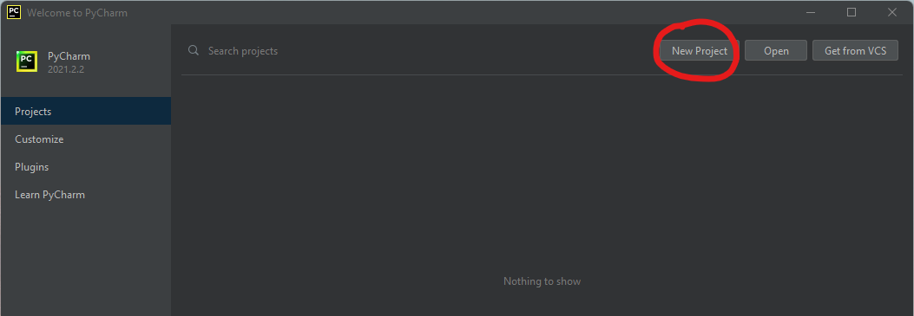
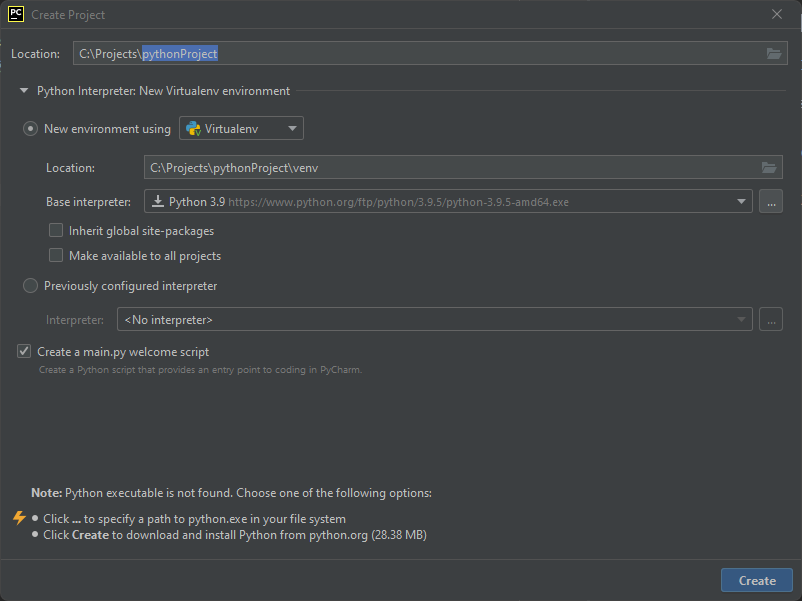
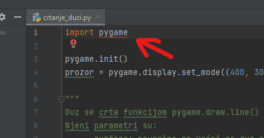
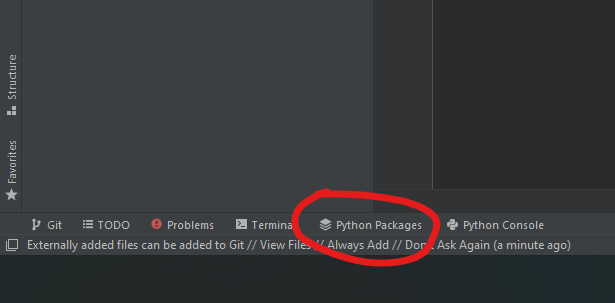
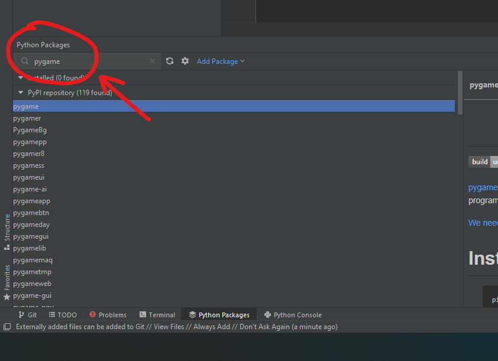
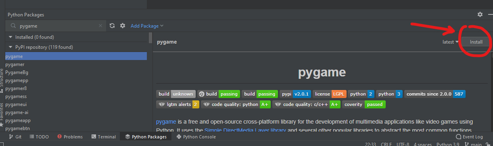

# Instalacija Pajtona
Kliknite na ovaj [link](https://www.python.org/ftp/python/3.9.7/python-3.9.7-amd64.exe),
to ce skinuti Pajton verzije 3.9.7 koja podrzava PyGame.

*~~Na sajtu [python.org](https://www.python.org/downloads/release/python-397/) 
kliknuti na dugme `Download` (to ce skinuti najnoviju verziju Pajtona 
za vas sistem) i zatim pokrenuti dobijen `.exe` fajl.~~* Ovo ne radi jer je 
upravo izasla verzija 3.10 sa kojom PyGame **trenutno ne radi**!

Proverite da li je instalacija uspesna tako sto cete otvoriti Command Prompt (ili Terminal) 
i ukucati komandu `python --version` odnosno `python3 --version`.
```
PS C:\Users\Daniil> python --version
Python 3.9.7
PS C:\Users\Daniil>
```

# Instalacija PyCharm razvojnog okruzenja
Skinuti PyCharm sa sajta [PyCharm](https://www.jetbrains.com/pycharm/). Obavezno izaberite 
besplatnu **Community** verziju, inace ce prestati da radi nakon nekog vremena.

Pokrenite `.exe` fajl koji ste skinuli i pratite korake na ekranu. Kada zavrsite instalaciju,
pokrenite PyCharm 🐍

## Stvaranje novog projekta
Kada otvorite PyCharm, kliknite na dugme `New Project`:
>   

Zatim ga nazovite kako god zelite. Sve ostalo bi trebalo da radi out of the box.
>   

## Namestanje biblioteke PyGame
Ako pokusate da sada koristite biblioteku PyGame, editor ce izbaciti gresku jer 
PyGame nije instaliran:
>   

Pratite sledece korake kako bi namestili PyGame.

### Korak 1: otvorite Python Packages (dugme u donjem levom uglu)
Python Packages je skup raznih biblioteka koje mozete koristti u Pajtonu
> 

### Korak 2: pretrazite `pygame` i kliknite na prvi rezultat
> 

### Korak 3: instalirajte PyGame
> 

Cestitke! Sada mozemo da krenemo sa pisanjem koda 😉