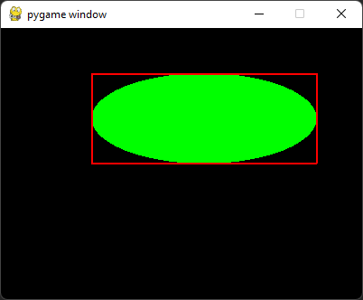
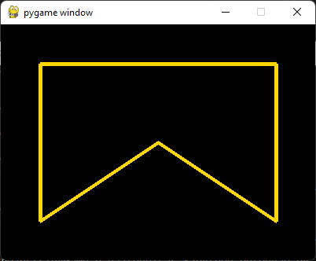

# Cas 3: Crtanje elipsi i mnogouglova

## Crtanje elipsi
Funkcija koja se koristi za crtanje krugova je `pygame.draw.ellipse`.
Parametri ove funkcije redom su:
1. prozor
2. boja
3. koordinate pravougaonika u koji je elipsa upisana

>   
> [*crtanje_elipsi.py*](crtanje_elipsi.py)

## Crtanje mnogouglova
Mnogougao se crta funkcijom `pygame.draw.polygon()`
Njeni parametri su:
1. surface: povrsina na kojoj se duz crta
2. color: boja
3. points: lista koordinata temena mnogougla

Funkcija sa ova tri parametra iscrtava mnogougao i popunjava ga 
izabranom bojom. Na primer:

```python
# obojen zeleni trougao
pygame.draw.polygon(surface=prozor,
                    color=pygame.Color('green'),
                    points=[(50, 50), (350, 50), (50, 250)])

# neobojena crvena kontura
pygame.draw.polygon(surface=prozor,
                    color=pygame.Color('red'),
                    points=[(350, 250), (350, 50), (50, 250)],
                    width=5)
```

>   
> [*crtanje_mnoguglova.py*](crtanje_mnogouglova.py)

```python
# petougao
pygame.draw.polygon(surface=prozor,
                    color=pygame.Color('gold'),
                    points=[(50, 50), 
                            (350, 50), 
                            (350, 250), 
                            (200, 150), 
                            (50, 250)],
                    width=5)
```

>    
> [*petougao.py*](petougao.py)