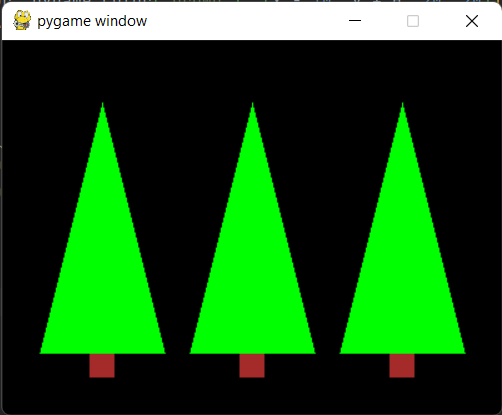
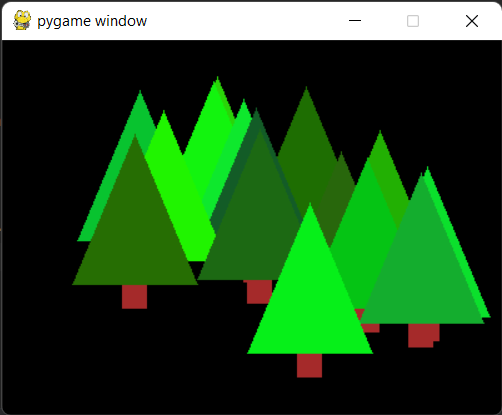

## Domaci 3. nedelja

### 1 - Obnavljanje

Obnovite ono sto smo do sada radili (pogotovo koordinatni sistem)
i obnovite kako se koriste petlje u Pajtonu. Preporucujem da 
za to koristite materijale na 
[petlja.org](https://petlja.org/biblioteka/r/lekcije/prirucnik-python/kontrolatoka-cas11).

### 2 - Zimzelena suma

Vas zadatak je da proucite i razumete kod [jelka.py](jelka.py)
i da napravite zimzelenu sumu.

> 

### Bonus (za razmisljanje)

Nijedno drvo nema bas istu boju, a tu nepravilnost u programiranju
mozemo da simuliramo koriscenjem slucajnih brojeva i biblioteke
`random`.

Na primer, ako zelimo da program odredi rezultat bacanja kockice,
mozemo da koristimo funkciju `random.randint(a, b)` koja vraca ceo 
broj `N` takav da vazi `a ≤ N ≤ b` na sledeci nacin:
```python
import random
print(random.randint(1, 6))
```

Ovaj pristup mozemo korisiti i u druge svrhe. Na primer, mozemo 
birati slucajnu nijansu zelene boje (boja bi bila u formatu 
`(0, X, 0)` gde je X slucajan broj) ili cak poziciju drveta 
na slici (slucajne `x` i `y` koordinate). Razmislite kako bi to 
mogli da uradite.

> 


