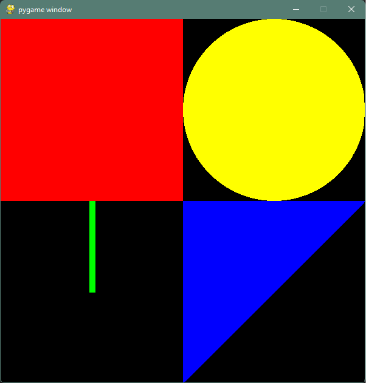

# 4. nedelja - obnavljanje

Napisite PyGame program koji crta sledecu sliku (dimenzije prozora su 600x600):

> 

```python
import pygame
pygame.init()
prozor = pygame.display.set_mode((600, 600))

pygame.draw.rect(prozor, pygame.Color("red"), (0, 0, 300, 300))
pygame.draw.circle(prozor, pygame.Color("yellow"), (450, 150), 150)
pygame.draw.polygon(prozor, pygame.Color("blue"), [(300, 300), (600, 300), (300, 600)])
pygame.draw.line(prozor, pygame.Color("green"), (150, 300), (150, 450), 10)

pygame.display.flip()
pygame.time.wait(5000)
pygame.quit()
```


