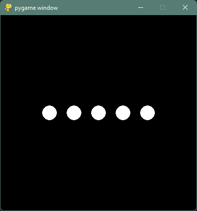
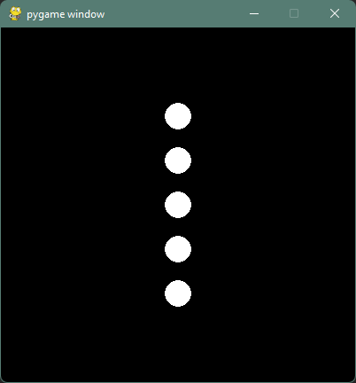
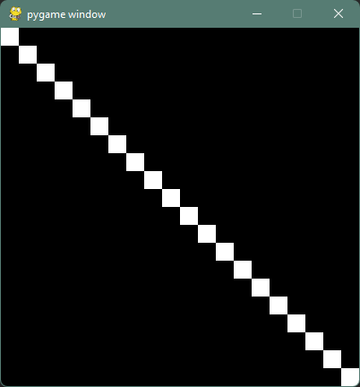
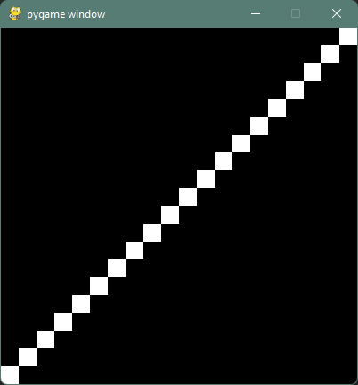
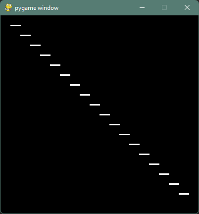
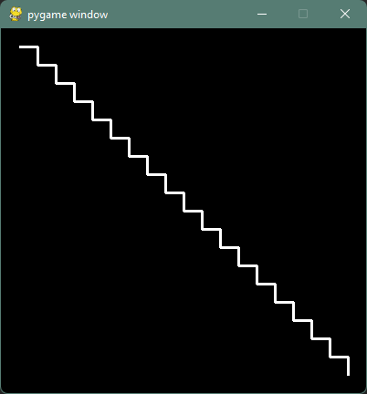
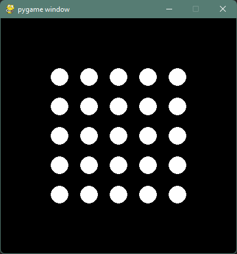

# 5. nedelja
Napisite porgrame koji iscrtavaju ove slike koriscenjem petlji.

### Zadatak 1: kugle
> 
> 

### Zadatak 2: dijagonala
> 

### Zadatak 3: dijagonala II
Obratite paznju na zbir `x` i `y` koordinata svakog kvadratica. 
> 

### Zadatak 4: stepenice
> 

### Zadatak 5: stepenice II
Iskoristite kod iz proslog zadatka! Potreban je samo mali dodatak.
> 

### Zadatak 6: kugle (tabla)
[🔗 Ugnjezdjene petlje](https://petlja.org/biblioteka/r/lekcije/prirucnik-python/kontrolatoka-cas11#id25)  
> 

## Resenja
1. [z1_kugle.py](z1_kugle.py) i [z1_kugle_vertikalno.py](z1_kugle_vertikalno.py)
2. [z2_dijagonala.py](z2_dijagonala.py)
3. [z3_dijagonala_II.py](z3_dijagonala_II.py)
4. [z4_stepenice.py](z4_stepenice.py)
5. [z5_stepenice_II.py](z5_stepenice_II.py)
6. [z6_kugle_tabla.py](z6_kugle_tabla.py)
