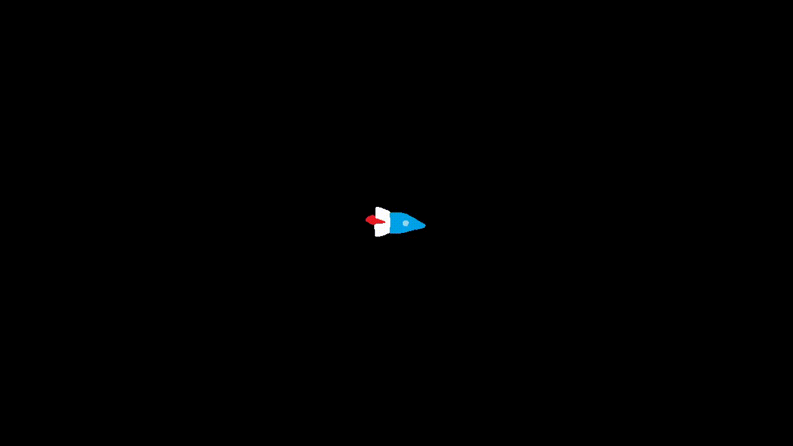

# Kretanje deobom vremena na male intervale

U stvarnom zivotu kretanje je glatko. Racunari rade sa brojevima, i preciznost tih brojeva
je ogranicena. Zbog toga kretanje koje mozemo da pravimo u programu ne moze biti glatko.

Na primer, uzmemo loptu koja se krece udesno. Neka je njena brzina 60 piksela po sekundi. 
Kako vecina monitora moze da prikazuje samo 60 slika u sekundi, na svakoj slici bi se lopta
pomerila za 1 piksel udesno. Nakon jedan sekund (i 60 promena slike), lopta bi se nasla 60 
piksela desno od pocetne pozicije. Lopta je zapravo napravila 60 skokova, ni u jednom trenutku
se ne krece!

Bas zbog ovoga se svako kretanje u racunarstvu odvija uz pomoc koriscenja malih vremenskih intervala,
najobicnije 1/30 ili 1/60 sekunde. To je povezano sa terminom FPS, brojem slika (**F**rejmova) **P**o 
**S**ekundi.

# Auto


Kod: [auto.py](auto.py)

Ideja je da napravimo program u kojem uz pomoc strelica `←` i `→` kontrolisemo auto koji se krece ubrzano.

Podestimo se formula ubrzanog kretanja: `v = v0 + a * t` i `x = x0 + v * t`.

Postupak deobe na male intervale podrazumeva da nakon svakog frejma (1/30 sekunde) racunamo novu brzinu i 
poziciju. To jest ove formule primenjujemo u petlji 30 puta u sekundi, a `t` je zapravo trajanje jednog
frejma.

Za pocetak definisemo potrebne promeljive i konstante: pocetnu poziciju poziciju i brzinu, kao i vrednost
za ubrzanje i interval dt (cita se *delta te*):

```python
y = 150    # y-koordinata auta, ne menja se
x = 450    # x-koordinata auta
v = 0      # brzina auta (na pocetku stoji)
a = 100    # ubrzanje auta u pikselima/s^2
dt = 1/30  # vremenski interval - trajanje jednog frejma
```

U petlji programa proveravamo pritise na strelice, i na odgovarajuci nacin menjamo brzinu po formuli.
Zatim koristimo tako dobijenu brzinu da izracunamo novu poziciju. Primetite, ako je brzina negativna, 
pozicija ce da se 'smanjuje', a to samo znaci da se auto krece ulevo:

```python
tasteri = pygame.key.get_pressed()
if tasteri[pygame.K_LEFT]:
    v = v - a * dt
if tasteri[pygame.K_RIGHT]:
    v = v + a * dt
    
x = x + v * dt
```

Citav kod mozete pogledati [ovde (auto.py)](auto.py).

# Raketa


Kod: [raketa.py](raketa.py)

U ovom programu simuliramo kretanje rakete u svemiru: pritiskom na strelicu gore raketa ubrzava,
a pritiskom strelica levo/desno okrece se oko svoje ose.

Formule za kretanje su iste, razlika je u tome da moramo da koristimo vekore, posto se kretanje 
odvija u ravni, pa nam obicni brojevi nisu dovoljni. Pored toga, moramo da implementiramo i rotaciju
oko svoje ose, sto samo po sebi nije trivijalno. Krenimo od toga.

### Rotacija (racunski deo)

Za rotaciju su nap potrebne dve promenljive: trenutan ugao za koji je rotirana raketa, kao i brzina 
kojom se trenutno okrece. Potrebna nam je i konstanta: 'ubrzanje' sa kojim se menja brzina rotacije:

```python
dt = 1/30

rotacija = 0
brzina_rotacije = 0
ubrzanje_rotacije = 15
```

... i zatim u petlji:

```python
tasteri = pygame.key.get_pressed()
if tasteri[pygame.K_LEFT]:
    brzina_rotacije += ubrzanje_rotacije * dt
if tasteri[pygame.K_RIGHT]:
    brzina_rotacije -= ubrzanje_rotacije * dt
    
rotacija = rotacija + brzina_rotacije
```

### Rotacija slike oko njenog centra (tezi deo zadatka)

Odradili smo racunski deo rotacije, ali sada je dosao red da prikazemo rotiranu raketu na ekranu.
Za to koristimo funkciju `pygame.transform.rotate()`, ali samo to za sebe nije dovoljno... 
Pogledajte kako ova funkcija menja sliku aviona:

  
[Losa rotacija](https://stackoverflow.com/questions/4183208/how-do-i-rotate-an-image-around-its-center-using-pygame)

Kako postici da zapravo iscrtamo rotaciju oko sopstvenog centra? Najlakse resenje se zasniva na tome da
rotiranu sliku pomeramo tako da se njen centar uvek nalazi na istom mestu (zelena tacka u primeru gore
bi se pomerala, a fiksiran bi bio centar - zeelna tacka u primeru dole):


Pitanje je: kako naci koordinate gornje leve tacke slike u poslednjem primeru?


Poznata nam je tacka P (pozicija gde zelimo da nacrtamu objekat/raketu). Mozemo lako da saznamo i 
dimenzije slike/pravougaonika uz pomoc `get_rect()`. 

Stovise, `slika.get_rect().centar` ce nam dati vektor pozicije centra slike u odnosu na gornju
levu tacku, to jest vektore `-xa` i `-xb` na slici! Dalje tacke A i B mozemo lako odrediti:

`a = p - (-xa) = p + xa`  
i  
`b = p - (-xb) = p + xb`

U kodi t izgleda ovako:
```python
# rotiramo sliku rakete i dobijamo novu sliku novih dimenzija
rotirana_slika = pygame.transform.rotate(raketa, rotacija)

# crtamo sliku na poziciji: p + xa
prozor.blit(rotirana_slika, pozicija - rotirana_slika.get_rect().center)
```

### Racunanje promene brzine i pozicije
Formule su iste kao i u slucaju auta. Jedina razlika je st koristimo vektore jer se retane odvija
u ravni. Pisemo:
```python
if tasteri[pygame.K_UP]:
    brzina = brzina + ubrzanje.rotate(rotacija) * dt
```
Obratimo paznju na izraz `ubrzanje.rotate(rotacija)` - ubrzanje se odvija u pravcu u kojem je
raketa rotirana. Funkcija `rotate(stepeni)` rotira vektor zadat broj stepeni, pri cemu zadrzava njegov
intenzitet. Na ostaje da promenimo poziciju:
```python
pozicija = pozicija + Vector2(brzina.x, -brzina.y) * dt
```
I ovde imamo nesto cudno: `Vector2(brzina.x, -brzina.y)`. Razlog za ovo je koordinatni sistem
koji se koristi u racunarstvu; naime, y-osa je usmerena nadole. Zato ako zelimo da se raketa 
krece nadole, umesto da smanjujemo y-koordinatu kao sto bi inace radili, moramo da je povecavamo.
Zato umesto izracunate brzine koristimo brzinu sa negiranom y-komponentom.

Ceo kod mozete pogledati i testirati [ovde (raketa.py)](raketa.py).
