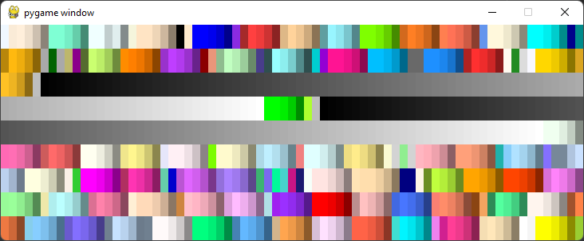

# Cas 2: Koordinate, boje, crtanje osnovnih oblika

## Koordinatni sistem
Koordinate su veoma bitan pojam u PyGame-u jer se pozicija
svakog oblika koji crtamo na ekranu zadaje bas uz pomoc
njegovih koordinata.

Koordinatni sistem kod racunara se razlikuje od onog 
koji smo ucili i na koji smo navikli u matematici; svaka 
tacka se i dalje zadaje uz pomoc dve koordinate **x** i **y**.
**x** koordinatu koristimo kao i pre, a **y** koordinata je 
'prevrnuta', to jest sto je tacka niza na ekranu to je 
vrednost **y** koordinate veca.

>   
> Koordinatni sitem u racunarstvu  
> *Izvor: [petlja.org](https://petlja.org)*

Drugim recima, prva koordinata odredjuje koliko je tacka
udaljena od leve ivice prozora, a druga koliko je tacka
udaljena od gornje ivice prozora.

## Boje
Prosli cas smo pricali or RGB nacinu zapisivanja boja. Boje
je moguce zadavati na taj nacin, ali u PyGame postoje i 
predefinisan skup osnovnih boja. Medju njima su boje poput
crvene, zelene, crne, zute, itd. Koristimo ih tako sto napisemo
`pygame.Color('naziv boje na engleskom')`. Na primer, 
`pygame.Color('yellow')` je zuta boja, a 
`pygame.Color('red')` je crvena.

Pokretanjem koda
```python
import pygame
pygame.init()
prozor = pygame.display.set_mode((400, 300))  # stvaramo prozor dimenzija 400x300
prozor.fill(color=pygame.Color('yellow'))  # bojimo ceo prozor zutom bojom
pygame.display.flip()  # promene u baferu saljemo na ekran
pygame.time.wait(3000)
pygame.quit()
```

>   
> [*zuti_prozor.py*](zuti_prozor.py)

Fun fact: tako 'gotovih' boja ima 657 (vecinom su razlicite nijanse 
istih osnovnih boja), U tih 657 boja ukljucene su boja zlata (`gold`) i 
boja psenice (`wheat`).

>   
> [*sve_boje.py*](sve_boje.py)

### RGB boje
Pored predefinisanih, mozete koristiti i boje zadatake u RGB formatu
koji opisuje boju kao kombinaciju crvene (Red), zelene (Green) i plave
(Blue). Na primer, crvena boja `pygame.Color('red')` je isto sto i 
`(255, 0, 0)` u RBG fromatu, pa mozemo je zapisati i na ovaj nacin.

RGB vrednosti za boje mozete odrediti uz pomoc [ove Guglove alatke](https://g.co/kgs/ZKe38V).

## Crtanje osnovnih oblika
Sve funkcije za crtanje u biblioteci PyGame pocinju sa `pygame.draw`.
Naucicemo kako se crtaju duzi, pravougaonici i krugovi.

### Crtanje duzi
Duz se crta pozivom funkcije `pygame.draw.line`. Ova funkcija zahteva 
nekoliko parametara (redosled je bitan):
1. povrsinu na kojoj crtamo duz (u nasem slucaju to je prozor)
2. boja duzi
3. koordinate prvog temena u obliku (x1, y1) 
4. koordinate drugog temena u obliku (x2, y2)
5. deljina duzi u pikselima

Na primer:
```python
pygame.draw.line(prozor, pygame.Color('yellow'), (50, 50), (300, 150), 5)
pygame.draw.line(prozor, pygame.Color('red'), (150, 50), (150, 250), 5)
```

>   
> [*crtanje_duzi.py*](crtanje_duzi.py)
 
### Crtanje kvadrata i pravougaonika
Funkcija koja se koristi za crtanje kvadrata i pravougaonika je
`pygame.draw.rect` (*rect* je skraceno za *rectangle* odnosno pravougaonik).
Parametri ove funkcije redom su:
1. prozor
2. boja
3. cetvorka brojeva (x, y, sirina, visina). **x** i **y** su koordinate gornjeg
levog temena pravougaonika, a **sirina** i **visina** su njegove dimenzije.

Na primer:
```python
import pygame

pygame.init()
prozor = pygame.display.set_mode((400, 300))

pygame.draw.rect(prozor, pygame.Color('green'), (50, 100, 150, 150))  # zeleni kvadrat dimenzija 150x150
pygame.draw.rect(prozor, pygame.Color('red'), (100, 50, 200, 100))  # crveni pravougaonik dimenzija 200x100

pygame.display.flip()
pygame.time.wait(3000)
pygame.quit()
```
>   
> [*crtanje_pravougaonika.py*](crtanje_pravougaonika.py)

Mozemo dodati i cetvrti parametar `width` koji predstavlja debljinu konture u pikselima.
U ovom slucaju oblik koji nacrtamo nece biti popunjen, to jest nacrtace se samo njegova
kontura:
```python
pygame.draw.rect(prozor, pygame.Color('green'), (50, 100, 150, 150), 2)  # zeleni kvadrat dimenzija 150x150
pygame.draw.rect(prozor, pygame.Color('red'), (100, 50, 200, 100), 2)  # crveni pravougaonik dimenzija 200x100
```
>   

Isto vazi i za sve sledece oblike.

### Crtanje krugova
Funkcija koja se koristi za crtanje krugova je `pygame.draw.circle`.
Parametri ove funkcije redom su:
1. prozor
2. boja
3. koordinate centra kruga
4. poluprecnik kruga

Na primer, sledeci kod iscrtava metu:
```python
pygame.draw.circle(prozor, pygame.Color('red'), (200, 150), 100)
pygame.draw.circle(prozor, pygame.Color('white'), (200, 150), 50)
```

>   
> [*crtanje_krugova.py*](crtanje_krugova.py)

### Crtanje elipsi
Funkcija koja se koristi za crtanje krugova je `pygame.draw.ellipse`.
Parametri ove funkcije redom su:
1. prozor
2. boja
3. koordinate pravougaonika u koji je elipsa upisana

>   
> [*crtanje_elipsi.py*](crtanje_elipsi.py)

### Bonus: imenovani parametri
U Pajtonu posotje takozvani imenovani parametri. Kada pozivamo funkciju, 
takve parametre mozemo prosledjivati po imeno i u proizvoljnom redosledu.

Kod funkcija sa vise parametara to pomaze da vas kod bude citljiviji.

Na primer, sledeci poziv funkcije `pygame.draw.line`
```python
pygame.draw.line(prozor, pygame.Color('yellow'), (50, 50), (300, 150), 5)
```
mozemo zapisati ovako:
```python
pygame.draw.line( surface = prozor,
                  color = pygame.Color('yellow'),
                  start_pos = (50, 50),
                  end_pos = (300, 150),
                  width = 5 )
```
U daljim materijalima cemo koristiti bas ovakav zapis.

### Bonus: crtanje mnogouglova
Mnogougao se crta funkcijom `pygame.draw.polygon()`
Njeni parametri su:
1. surface: povrsina na kojoj se duz crta
2. color: boja
3. points: lista koordinata temena mnogougla

Funkcija sa ova tri parametra iscrtava mnogougao i popunjava ga 
izabranom bojom. Na primer:

```python
# obojen zeleni trougao
pygame.draw.polygon(surface=prozor,
                    color=pygame.Color('green'),
                    points=[(50, 50), (350, 50), (50, 250)])

# neobojena crvena kontura
pygame.draw.polygon(surface=prozor,
                    color=pygame.Color('red'),
                    points=[(350, 250), (350, 50), (50, 250)],
                    width=5)
```

>   
> [*crtanje_mnogugla.py*](crtanje_mnogougla.py)


