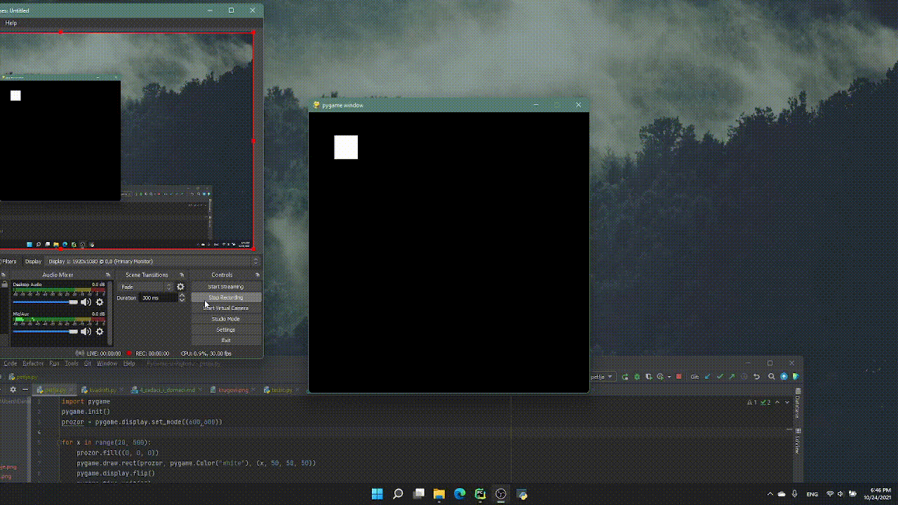

## Kretanje objekata
Mozemo napraviti prividno kretanje tako sto vise puta ispocetka crtamo 
sliku sa izmenama i na taj nacin stvaramo iluziju da se nesto krece
(iako na svakoj slici stoji, samo se slike brzo smenjuju).

Ovakve slike se zovu frejmovi, a sto vise prikazujemo slika u sekundi to je 
animacija vise glatka. Brooj slika u sekundi se zove `FPS` (frames per second), 
i cesto uzimamo da FPS bude 30 ili 60. Za sada taj detalj nije bitan, ali ce nam
biti potreban kasnije.

```python
import pygame
pygame.init()
prozor = pygame.display.set_mode((600,600))


for x in range(20, 500):
    prozor.fill((0, 0, 0))
    pygame.draw.rect(prozor, pygame.Color("white"), (x, 50, 50, 50))
    pygame.display.flip()
    pygame.time.wait(10)

pygame.display.flip()
pygame.time.wait(5000)
pygame.quit()
```

U kodu gore mnogo puta crtamo kvadrat pri cemu se u svakom ponavljanju 
pomera udesno (x raste, a sto je x vece to je i kvadrat levlji). Ovaj kod 
izvrsavamo na svakih 10 milisekundi, cime dobijamo oko 100 FPS.




