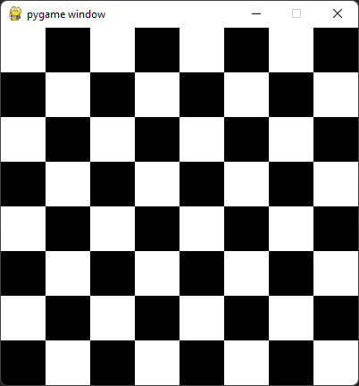

## Bonus zadatak: sahovska tabla

Koriscenjem petlji, nacrtati sahovsku tablu u prozoru dimenzija 400x400  [🔗 Ugnjezdjene petlje](https://petlja.org/biblioteka/r/lekcije/prirucnik-python/kontrolatoka-cas11#id25)  

Pogledajte zbirove rednih brojeva kolona i redova svakog belog polja. Sta primecujete?  

> 