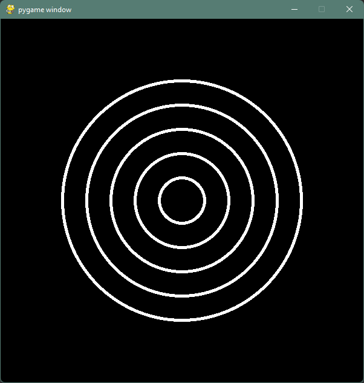
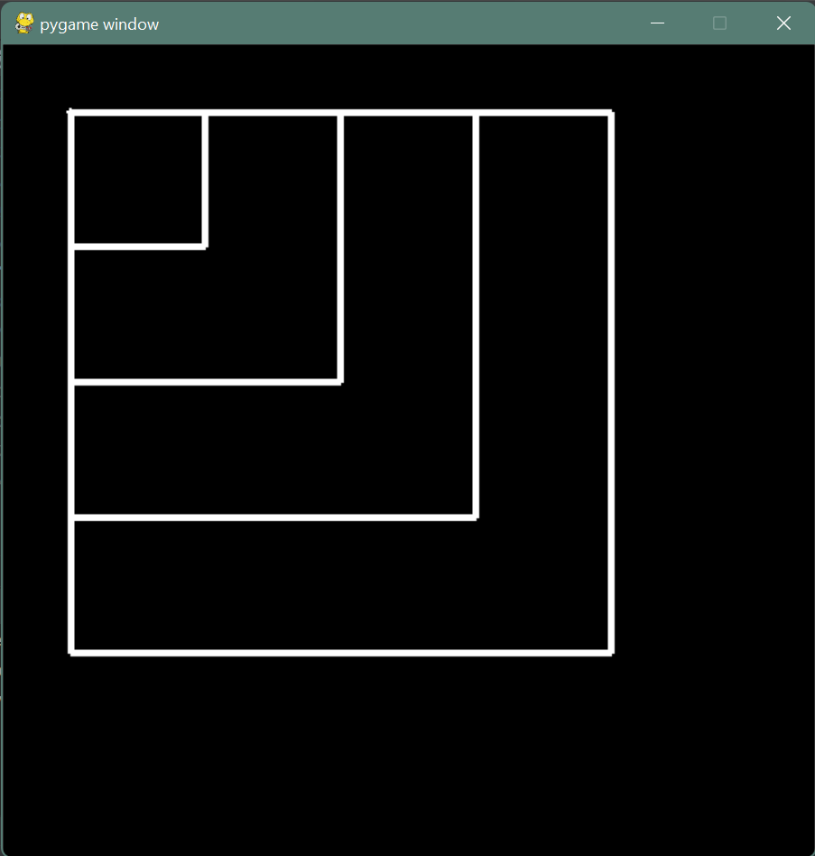
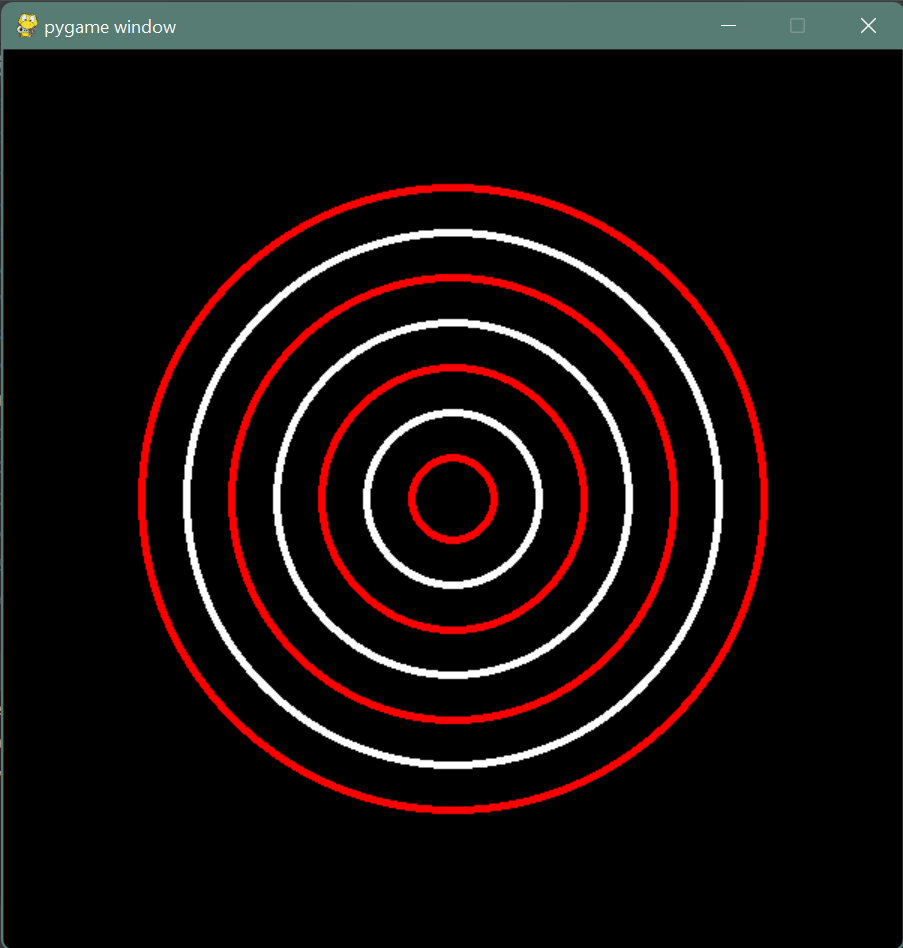

# 4. nedelja: crtanje pravilnih oblika uz pomoc petlji

## Zadatak 0: krugovi
Napisite PyGame program koji crta **koncentricne** krugove
(krugove koji imaju isti centar, a razlicite radiuse) koriscenjem
petlji (`for` ili `while`). 
[🔗 Podsetnik kako se koriste petlje](https://petlja.org/biblioteka/r/lekcije/prirucnik-python/kontrolatoka-cas11#id12)  

  
Hint

<blockquote>
  Razmislite o tome koja vrednost se menja tokom promene velicine kruga. 
  Neka ta vrednost bude brojac u petlji.
</blockquote>

  

  
Resenje

<blockquote>
Kod u petlji se ponavlja 5 puta, pri cemu <code>i</code> prolazi 
kroz vrednosti <code>[0,4]</code>. Crtamo 5 koncentricnih krugova
ciji su poluprecnici <code>(i+1)*40</code>, to jest 40, 80, 120, 
160 i 200.
</blockquote>

    import pygame   
    pygame.init()   
    prozor = pygame.display.set_mode((600,600))  
    
    for i in range(5):  
        pygame.draw.circle(prozor, pygame.Color("white"), (300, 300), (i+1) * 40, 5)  
    
    pygame.display.flip()  
    pygame.time.wait(5000)  
    pygame.quit()

  

> 

## Zadatak 1: kvadrati
Nacrtati sledecu sliku:

> 

## Zadatak 2: krugovi, ali u 2 boje
Vas zadatak je da kod iz proslog zadataka promenite tako da se boje
krugova naizmenicno smenjuju: crvena, pa bela, pa ponovo crvena, itd.

> 

## Bonus zadatak: sahovska tabla
Koriscenjem petlji, nacrtati sahovsku tablu u prozoru dimenzija 400x400.
[🔗 Ugnjezdjene petlje](https://petlja.org/biblioteka/r/lekcije/prirucnik-python/kontrolatoka-cas11#id25)

> 
