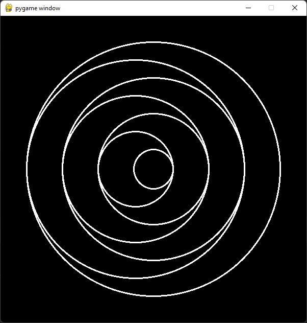

# Veliki Domaci

### Pomeranje niza
Na ulazu su dati niz prirodnih brojeva `arr` i prirodan broj `k`, pri cemu 
`k < len(niz)`. Vas zadatak je da prvih `k` elemenata niza pomerite na njegov kraj.

Unos niza u Pajtonu mozemo odraditi na dva nacina (za one ko zna kako):
```python
# prvi nacin koriscenjem funkcije map
arr = list( map( int, input().split() ) )

# drugi nacin koriscenjem list comprehension
arr = [ int(i) for i in input().split() ]
```
Niz ispisite koriscenjem naredbe `print(arr)`, ne moramo tu nista da komplikujemo.

> **Primer**
> 
>       1 2 3 4 5 6 7
>       3
>       [4, 5, 6, 7, 1, 2, 3]
> *k=3, pa smo prva tri elementa niza 1, 2 i 3 smestili na njegov kraj.*  

### Petlja za ulaz
Napisi program koji na ulazu prihvata prirodne brojeve sve dok se ne unese `0`, 
pa zatim ispisuje zbir unetih brojeva.

> **Primer**
> 
>       1
>       2
>       6
>       7
>       -2
>       0
> `Zbir je 14`


### Ispisi matricu
Napisi program koji za dato `N` ispisuje matricu brojeva `N x N` takvu
da su u prvoj dijagonali nule, u drugoj jedinice, itd..:
> **Primer 1**  
> 
> Za n = `3`, program ispisuje
> 
>       0 1 2 
>       1 2 3 
>       2 3 4 

> **Primer 2** 
> 
> Za n = `5`, program ispisuje
> 
>       0 1 2 3 4 
>       1 2 3 4 5 
>       2 3 4 5 6 
>       3 4 5 6 7 
>       4 5 6 7 8 

## PyGame zadaci
Napisite kodove koje iscrtavaju sledece slike:

### 5 kocki A


### 5 kocki B


### Zastava Britanije


### Krugovi u 3 boje


### Desni krugovi 


### Naizmenicni krugovi

