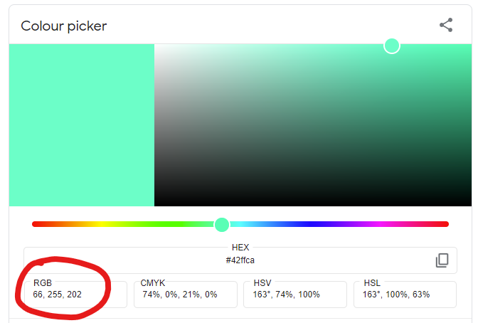

## Boje i `pygame.draw` funkcije za crtanje

### Boje
Bojemo mozemo da zadajemo u RGB formatu kao trojku vrednosti izmedju 0 i 255
koje redom predstavljaju jacine crvene, zelene, i plave boje:
* `(255, 0, 0)` odgovara <b style="color:#FF0000">crvenoj</b> boji,
* `(255, 0, 255)` je <b style="color:#FF00FF">ljubicasta</b> boja,
* `(255, 255, 0)` je <b style="color:#FFFF00">zuta</b>,
* `(127, 127, 127)` je <b style="color:#7f7f7f">siva</b>...

Ove vrednosti mozete odredjivati uz pomoc 
[Guglove alatke color picker](https://g.co/kgs/vrVkgm).

> 

Pored toga mozete koristiti i predefinisane boje tako sto cete pisati
`pygame.Color("naziv boj ena engleskom")`. Na primer, `pygame.Color("white")`
i `pygame.Color("purple")`.

### Crtanje osnovnih oblika
```python
# obojen krug
pygame.draw.circle(prozor, boja, (x_centra, y_centra), poluprecnik)

# kruznica
pygame.draw.circle(prozor, boja, (x_centra, y_centra), poluprecnik, debljina_linije)

# tacka (krug ciji je poluprecnik 1)
pygame.draw.circle(prozor, boja, (x_centra, y_centra), 1)
```
```python
# duz
pygame.draw.line(prozor, boja, (x1, y1), (x2, y2), debljina_linije)
```
```python
# obojen pravougaonik
pygame.draw.rect(prozor, boja, (x_gornjeg_levog_temena, y_gornjeg_levog_temena, sirina, visina))

# neobojen pravougaonik (samo linija)
pygame.draw.rect(prozor, boja_linije, (x, y, sirina, visina, debljina_linije))
```

```python
# obojen mnogougao
# u kvadrtanim zagradama nabrajamo temena mnogougla u formatu (x,y)
pygame.draw.polygon(prozor, boja, [ (x1,y1), (x2,y2),.. ])

# neobojen mnogougao (samo linija)
pygame.draw.polygon(prozor, boja_linije, [ (x1,y1), (x2,y2),.. ], debljina_linije)
```
