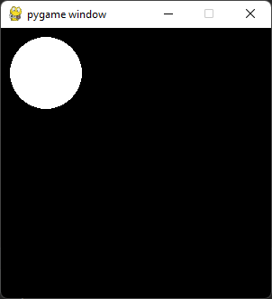

## Osnovna struktura PyGame programa

Da bi smo napravili najjedonstavniji pygame program, potrebno je
da odradimo niz koraka kako bi pripremili biblioteku za koriscenje.

Potrebno je da **(1)** ukljucimo biblioteku i **(2)** otvorimo prozor 
zadatih dimenzija.
```python
import pygame
prozor = pygame.display.set_mode((sirina, visina))
```

Sada smo spremni da crtamo. Za to koristimo funkcije `pygame.draw` (spisak svih koje 
smo radili mozes naci [ovde](podsetnik_crtanje.md)). Na primer, da bi smo nacrtali 
beli krug sa centrom u `(50, 50)` i poluprecnikom `40` piksela, pozivam komandu
```python
pygame.draw.circle(prozor, pygame.Color("white"), (50, 50), 40)
```

Kada pozivamo `pygame.draw` komande PyGame ne crta direktno na ekran, vec sliku
smesta u privremeno skladiste koje se zove **bafer** (*buffer* na engleskom). Da 
bi smo sliku u baferu prikazali na ekranu, pozivamo `pygame.display.flip()` 
(analogija sa tablom koja se okrece - crtamo sa zadnje strane dok korisnik vidi 
prednju. Kada je slika gotova, tablu okrecemo, otuda i naziv *flip*).

Pre zavrsetka programa pozivamo `pygame.time.wait(milisekunde)` da bi smo programu
naredili da saceka neko vreme pre zatvranja. To vreme zadajemo u milisekundama, dakle 
`pygame.time.wait(3000)` znaci *"sacekaj 3 sekunde"*. Finalni kod izgleda ovako:
```python
import pygame
prozor = pygame.display.set_mode((300, 300))
pygame.draw.circle(prozor, pygame.Color("white"), (50, 50), 40)
pygame.display.flip()
pygame.time.wait(3000) # ceka 3 sekunde
```
i iscrtava sledecu sliku:
> 
